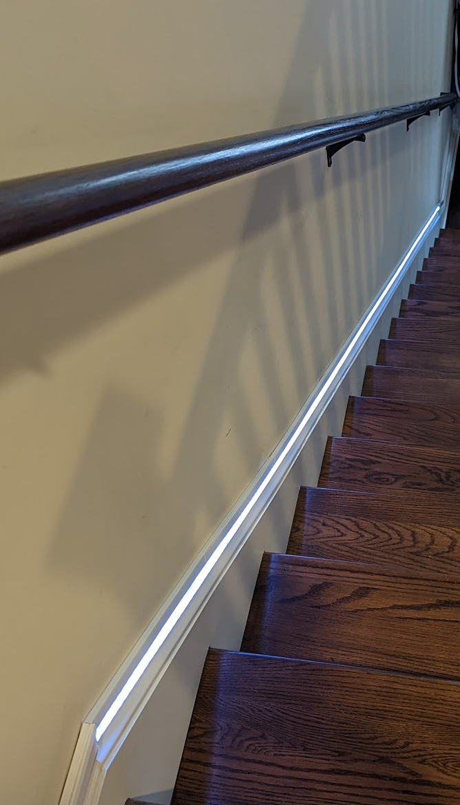

# raspberry-pi-pico-ws2812b-stair-lighting
Use a pico to control up/down lighting on a stairway

This is the equivalent of the same configuration found [here](https://github.com/gamename/raspberry-pi-ws2812b-stair-lighting), except that this uses a Raspberry Pi Pico instead.

# Wiring Diagram

# Demo

# Pictues

